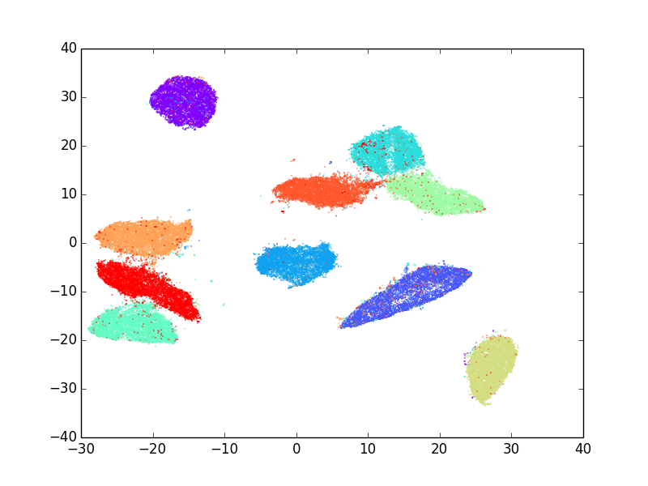

#LargeVis
This is the *official* implementation of the **LargeVis** model by the original authors, which is used to visualize large-scale and high-dimensional data [(Tang, Liu, Zhang and Mei)](https://arxiv.org/abs/1602.00370). It now supports visualizing both high-dimensional feature vectors and networks. The package also contains a very efficient algorithm for constructing K-nearest neighbor graph (K-NNG).

Contact person: Jian Tang, tangjianpku@gmail.com. This work is done when the author is in Microsoft Research Asia.

##Install
Both C++ source codes and Python wrapper are provided on Linux, OS X and Windows. To install the package, external packages are required, including [GSL (GNU Scientific Library)](http://www.gnu.org/software/gsl/) on Linux and OS X or [BOOST](http://www.boost.org/) on Windows for generating random numbers.

####Linux

Install gsl (Debian):
```
sudo apt-get install libgsl0-dev
```

Compile the source files via:
```
g++ LargeVis.cpp main.cpp -o LargeVis -lm -pthread -lgsl -lgslcblas -Ofast -march=native -ffast-math
```

To install the Python wrapper, modify ```setup.py``` to make sure that the GSL path is correctly set and then run ```sudo python setup.py install```.

####OS X
Install gsl using [Homebrew](http://brew.sh/):
```
brew install gsl
```

Modify line 347 of ```annoylib.h``` to change ```lseek64``` to ```lseek```. Then compile the source files (in the Linux folder) via:
```
g++ LargeVis.cpp main.cpp -o LargeVis -lm -pthread -lgsl -lgslcblas -Ofast -march=native -ffast-math -L/usr/local/lib -I/usr/local/include
```

To install the Python wrapper, run ```sudo python setup.py install```.

####Windows
To compile the source files, use Microsoft Visual Studio, where you need to set the BOOST path.

To install the Python wrapper, modify ```setup.py``` to make sure that the BOOST path is correctly set and then run ```python setup.py install```.

##Usage
LargeVis is suitable for visualizing both high-dimensional feature vectors and networks. For high-dimensional feature vectors, the format of input file should be as follows: the first line specifies the number of feature vectors and the dimensionality (500 vectors with 10 dimensions in the following example), and each of the next 500 lines describes one feature vector with 10 float numbers.
```
500 10
1.0 1.0 1.0 1.0 1.0 1.0 1.0 1.0 1.0 1.0
1.0 1.0 1.0 1.0 1.0 1.0 1.0 1.0 1.0 1.0
...
...
1.0 1.0 1.0 1.0 1.0 1.0 1.0 1.0 1.0 1.0
```

For networks, each line of the input file is a DIRECTED edge. For each undirected edge, users must use TWO DIRECTED edges to represent it. For example,
```
0 1 2.5
1 0 2.5
2 5 4.5
5 2 4.5
3 10 3.0
...
...
495 498 1.5
```
For C++ executable file,
```
./LargeVis -input -output
```
or for Python,
```
python LargeVis_run.py -input -output
```

* `-input`: Input file of feature vectors or networks (see the Example folders for input format).
* `-output`: Output file of low-dimensional representations.

Besides the two parameters, other optional parameters include:
* `-fea`: specify whether the input file is high-dimensional feature vectors (1) or networks (0). Default is 1. 
* `-threads`: Number of threads. Default is 8.
* `-outdim`: The lower dimensionality LargesVis learns for visualization (usually 2 or 3). Default is 2.
* `-samples`: Number of edge samples for graph layout (in millions). Default is set to ```data size / 100``` (million). 
* `-prop`: Number of times for neighbor propagations in the state of K-NNG construction, usually less than 3. Default is 3.
* `-alpha`: Initial learning rate. Default is 1.0.
* `-trees`: Number of random-projection trees used for constructing K-NNG. 50 is sufficient for most cases unless you are dealing with very large datasets (e.g. data size over 5 million), and less trees are suitable for smaller datasets. Default is set according to the data size.
* `-neg`: Number of negative samples used for negative sampling. Default is 5.
* `-neigh`: Number of neighbors (K) in K-NNG, which is usually set as three times of perplexity. Default is 150.
* `-gamma`: The weights assigned to negative edges. Default is 7.
* `-perp`: The perplexity used for deciding edge weights in K-NNG. Default is 50.

##Examples
We provide some examples including MNIST(high-dimensional feature vectors) and CondMat(networks) in the ```Examples/``` folder.

For example, to visualize the MNIST dataset,
```
python LargeVis_run.py -input mnist_vec784D.txt -output mnist_vec2D.txt -threads 16
python plot.py -input mnist_vec2D.txt -label mnist_label.txt -output mnist_vec2D_plot
```



Please cite the following paper if you use LargeVis to visualize your data.
##Citation
```
@inproceedings{tang2016visualizing,
  title={Visualizing Large-scale and High-dimensional Data},
  author={Tang, Jian and Liu, Jingzhou and Zhang, Ming and Mei, Qiaozhu},
  booktitle={Proceedings of the 25th International Conference on World Wide Web},
  pages={287--297},
  year={2016},
  organization={International World Wide Web Conferences Steering Committee}
}
```
##Acknowledgement
Some methods of this package are from a previous work of the LargeVis authors, [LINE (Large-scale Information Network Embedding)](https://github.com/tangjianpku/LINE).
